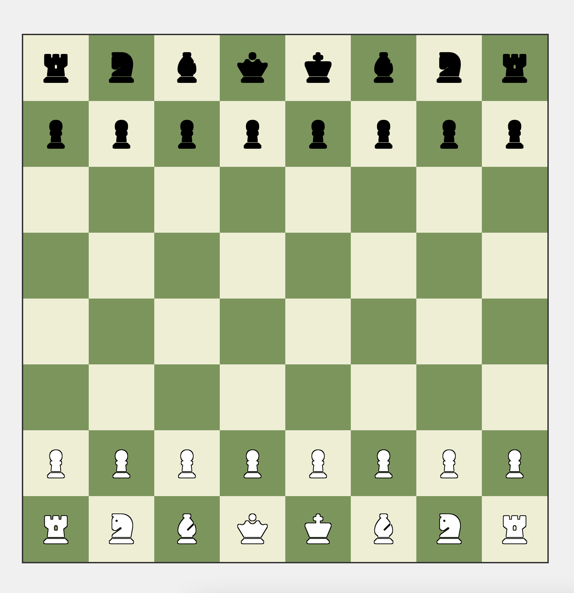

# Chessboard

Note, this is not a full chess game, but a chessboard that **can** be used to play chess.



## Features

- [x] Display a chessboard
- [x] Highlights legal moves
- [x] Shows pieces with FAS icons


## Getting Started

1. Clone and install the prerequisites

```bash
git clone https://github.com/Naainz/Chess.git
npm install
```

2. Start the development server

```bash
npm run dev
```

3. Open your browser and go to `http://localhost:4321`

## License

This project is licensed under the [MIT License](LICENSE)